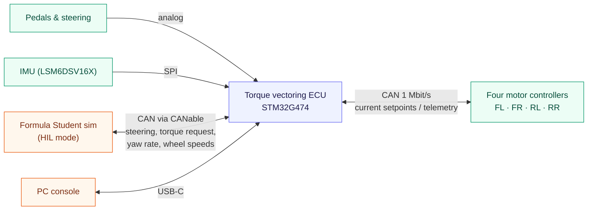

<div align="center">

# STM32 Torque Vectoring ECU

**Firmware for a four-motor torque vectoring and derating ECU on an STM32G474.**


*A lap of the Formula Student Germany 2024 track in the full-physics simulation this ECU
grew out of. Blue and yellow dots are cones, cyan is the racing line, the red box is the car.*

</div>

---

## What it does

The ECU sits on the car's CAN bus with four STM32 motor controllers (one per wheel,
from the STM32-Motor-Controller project). Every 10 ms it:

1. reads the driver's pedals and steering, its own IMU, and each controller's speed,
   temperature and bus voltage,
2. decides whether torque is allowed at all (startup, faults, plausibility checks),
3. works out how much torque the motors may give right now (derating),
4. splits the driver's torque request across the four wheels to help the car turn
   (torque vectoring),
5. sends each controller its current setpoint over CAN.

It can also run in **HIL mode**, where the Formula Student simulator stands in for
the car. The simulator sends steering, torque request, yaw rate and wheel speeds over
CAN, and reads back the torque the ECU commanded. The real motor controllers on the
bench take part exactly as they would on the car.

Battery management is out of scope for now: the bench runs from a lab power supply.



## Repository layout

```
ECU_Hardware/            KiCad schematics and PCB, board requirements, sensor pinout
docs/                    pictures from the earlier full-physics simulation
ECU_Firmware/
  app/                   the application, no hardware access (runs on the board and the PC)
    app.c                100 Hz control step and the drive state machine
    torque_vectoring.c   the yaw-rate torque vectoring law
    derate.c             torque limits from temperature, speed and bus voltage
    driver_inputs.c      pedals and steering, with the Formula Student plausibility rules
    motors.c             the motor controller CAN protocol, client side
    hil.c                inputs from the HIL simulator
    imu.c, gps.c         LSM6DSV16X gyro/accel driver, NMEA reader
    console.c            USB text console
    config.h             every number: car, sensors, limits, derating thresholds
    can_protocol.h       every CAN message (shared with the simulator)
  hal/hal.h              what the app needs from a board
  hal/stm32g474/         register-level drivers: clocks, ADC+DMA, SPI, UART, FDCAN, USB
  sim/                   the board in memory, and ecu_sim for simulator runs
  tests/                 unit and whole-application tests
Makefile                 shortcuts for the CMake builds, tests and formatting
```

The application only ever talks to `hal.h`. On the board that is the STM32 drivers;
on a PC it is `sim/sim.c`. The same application code is what gets tested, what runs in
the simulator, and what runs on the car.

## Torque vectoring

The steering angle and speed give the yaw rate the driver is asking for (a bicycle
model). The gyro gives the yaw rate the car really has. The difference moves torque
from one side of the car to the other:

```
base            = request / 4, inside the derated limits
target yaw rate = speed * tan(steering * 0.23) / wheelbase
correction      = 4 Nm per rad/s * (target - measured), at most 4 Nm,
                  and never more than the room both sides have left
left wheels     = base - correction
right wheels    = base + correction
```

The total torque never changes, only how it is shared. It works under regen too. The
law and gains are the same as the simulator's own software torque vectoring, so an HIL
lap can be compared directly with a pure simulation lap.

This is what it looks like on a car. Both pictures come from the full-physics simulation
this project started as, which used a grip-aware PID version of the same idea. At the
hairpin the outer wheels drive and the inner wheels regen, which swings the car round:

<div align="center">

</div>

Through a corner the four wheel torques start together, then fan apart as each wheel is
given its own share:

<div align="center">

</div>

## Derating

One factor covers the whole car, so derating never adds a yaw moment of its own.

| Input | Starts at | Zero torque at | Limits |
| --- | --- | --- | --- |
| Controller FET temperature | 80 C | 95 C (controllers trip at 100 C) | drive and regen |
| ECU board temperature | 70 C | 85 C | drive and regen |
| Motor speed (from the controllers) | 70 % of 10k rpm | 10k rpm | drive |
| Bus voltage, sagging | 14 V | 10 V (controllers trip at 8 V) | drive |
| Bus voltage, rising | 50 V | 56 V (controllers trip at 60 V) | regen |
| Car speed | 2 m/s | standstill | regen |

Regen fades out as the car stops, because at standstill a regen request would drive the
motors backwards. The rising-bus limit matters on the bench: a lab supply cannot absorb regen, so the bus
voltage climbs. The speed limit uses the speed the controller measures, because that
protects the real motor. An unloaded bench motor settles just under its limit instead of
running away. All thresholds are in `config.h`.

## When torque is allowed

| State | Meaning |
| --- | --- |
| `STARTUP` | first second: the gyro bias is measured, so the car must be still |
| `STANDBY` | ready, no torque. Controllers are kept idle |
| `DRIVE` | torque is sent every 10 ms |
| `FAULT` | latched after a hard stop while driving. No torque until `clear` on the console or a power cycle |

To arm, press the brake with the throttle released and hold it for 1 s in standby (a
stand-in until the car has a ready-to-drive button). After any disarm the brake has to be
lifted and pressed again. In HIL mode the simulator arms it instead, with a fresh drive
request. Arming needs every
controller online and healthy, main power present (so the pedal sensors are powered), a
working IMU and a healthy CAN bus.

Any of those failing while driving latches `FAULT` and keeps the cause in the status frame, so a flickering fault cannot re-arm the car. Two pedal problems
only zero the torque while they last, as the Formula Student rules ask:

- **Throttle sensor disagreement:** the two throttle sensors differ by more than 10 %
  for over 100 ms.
- **Brake with throttle:** the brake and more than 25 % throttle are pressed together.
  Torque stays at zero until the throttle drops below 5 %.

Torque only goes out once all four controllers are running, so one side can never drive
alone. On disarm the ECU sends zero current and an idle request to every controller at
once, and keeps sending zero current while disarmed. The controllers also stop by
themselves 250 ms after their setpoints stop, so a crashed or unplugged ECU is safe. The
watchdog resets the ECU after 100 ms.

## Steering wheel panel

The panel is a CAN node (17) that sends three dial values: torque vectoring strength,
drive power and regen. They scale the yaw correction and the drive and regen torque
limits, on top of derating. Without a panel everything stays at 100 %. If the panel goes
quiet the last values are kept, so a lost cable never raises a limit. The panel lights
its LEDs from the ECU's `STATUS` frame (state and inhibit bits). The console `status`
line shows the dial values.

## CAN bus

Classic CAN at 1 Mbit/s, 11-bit ids of the form `(node << 5) | message`, the scheme the
motor controllers already use. Floats are little endian. The full list is in
[`can_protocol.h`](ECU_Firmware/app/can_protocol.h).

| Node | Who | Messages |
| --- | --- | --- |
| 1 to 4 | motor controllers FL, FR, RL, RR | ECU sends `SET_STATE`, `SET_IQ`. They send heartbeat, iq and speed, bus volts and temperature |
| 16 | this ECU | `STATUS` (state, inhibit bits, derating) and `YAW` (target and measured) every 10 ms |
| 17 | steering wheel panel | `DIALS`: torque vectoring %, drive power %, regen % (0 to 100) |
| 16 | HIL simulator | `DRIVER`, `WHEELS_F`, `WHEELS_R`, then `CONTROL` last each tick |

Wheel torque is sent as controller current: 1.47 Nm per amp maps the car motor's 29.4 Nm
onto the controller's 20 A limit. The left motors are mounted mirrored, so their current
has the opposite sign. Set each controller's node id from its own console with `node <id>`.

## Build, flash and test

Needs CMake and Ninja, plus `arm-none-eabi-gcc` for the board (STM32CubeCLT has all
three) and a host C compiler for the tests.

```
make firmware     # ECU_Firmware/build/tv_ecu.elf, .hex and .bin
make flash        # over SWD with an ST-LINK and STM32CubeProgrammer
make test         # unit tests and whole-application tests on the PC
make test MC_DIR=../STM32-Motor-Controller/controller_firmware   # also the controller interop test
```

The interop test builds the real motor controller firmware for the PC and runs it
against this ECU. It checks that the ECU arms the controller, that the controller follows
the commanded current, that speed derating holds a free motor near its limit, and that
the controller stops when drive is switched off and when the ECU goes away.

## USB console

Plug in USB-C and open the virtual COM port with any terminal.

| Command | Does |
| --- | --- |
| `status` | state, inputs, torques, derating and any inhibit reasons |
| `stream on` / `stream off` | the status line every 100 ms |
| `motors` | one line per motor controller |
| `gps` | the latest GPS fix |
| `off` | stop sending torque |
| `clear` | ask every controller to clear its faults |
| `estop` | broadcast the controller e-stop |

## HIL testing with the Formula Student simulator

```
PC: Formula Student sim --TCP-- can_bridge.py --USB-- CANable 2.0 --CAN-- ECU board
                                                                    \-- motor controllers
```

1. Wire the CANable, the ECU and the motor controllers on one bus, terminated at both
   ends (the ECU has fixed split termination). Power the ECU and controllers from the
   bench supply.
2. Calibrate each motor controller and give it its node id (1 FL, 2 FR, 3 RL, 4 RR).
   Controllers you do not have are played by the simulator.
3. Start the bridge, with the CANable's COM port:
   `python tools/can_bridge.py --channel COM5`
4. Run the simulator with `HIL=1`, for example `HIL=1 python visualiser.py` or
   `HIL=1 make eval` in the simulator repo.

The simulator listens for 0.3 s to find which controllers are real, waits for the ECU to
reach standby, arms it, then drives. It drives the car model with the current the ECU
commanded; set `HIL_TORQUE=measured` to use the current the real controllers report
instead (useful with loaded motors). `HIL_FET_TEMP` and `HIL_BUS_V` change what the
simulated controllers report, to try derating.

Without any hardware, `ecu_sim` (built by `make sim`) plays the ECU on the PC and the
simulator talks to it in lock-step. The simulator's `make test-hil` runs its whole lap
matrix that way.

### Driverless mode

Set `HIL_AUTONOMY=ecu` in the simulator and the ECU does the driving. The simulator sends
the nearest 16 cones (range in cm, bearing in mrad, colour) as `HIL_MSG_CONE` frames, one
per cone, ahead of each `CONTROL` frame. Every 10 ms the ECU turns them into a centre line
(`app/planner.c`), steers with pure pursuit and sets the total torque request with a
proportional speed controller (`app/autonomy.c`), then sends the result back in
`ECU_MSG_COMMAND`. Torque vectoring, derating and the state machine work as before.

| Runs on the ECU | Runs on the PC |
| --- | --- |
| Cone gating and midpoints, pure pursuit, speed control, steering rate limit | Vehicle model, cone sensor, EKF-SLAM (display only) |

If complete cone scans stop arriving for 50 ms the ECU latches FAULT (`cones-lost`), like
any other hard stop. The planner and controller are a port of the simulator's own, with
fixed constants in `config.h`, so laps match the simulator's software autopilot only at
its default tunables. `make test-hil` in the simulator repo checks this.

**On the bench:** the motors are unloaded, so any torque spins them up until speed
derating holds them just under 10k rpm. Keep them guarded and clamped down.

## Where it came from

This repo started as a full-physics HIL simulation in C: a four-corner car model with
Pacejka tyres, load transfer and aero, a Stanley steering driver, a racing-line planner,
and a PID torque vectoring controller walled off behind the same kind of sensor
interface a real ECU would have. It lapped the FSG 2024 track in about 27 seconds, with
the actual speed following the planned speed closely:

<div align="center">

</div>

That simulation is still in the git history. The controller has now moved onto real
hardware, and HIL testing uses the Formula Student simulator instead.

## Not done yet

- Battery and BMS messages, and derating from state of charge.
- Pedal and steering calibration stored in flash (it is in `config.h` for now).
- A ready-to-drive button input.
- GPS is read and shown on the console, but not used by the controller.
- The IMU interrupt pin and the GPS PPS pin are wired but not used.
